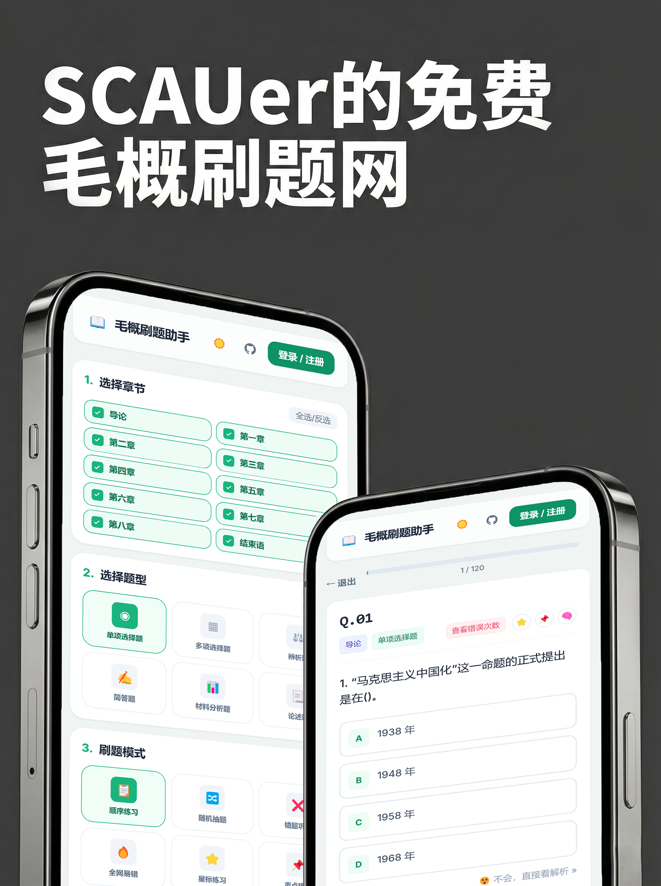
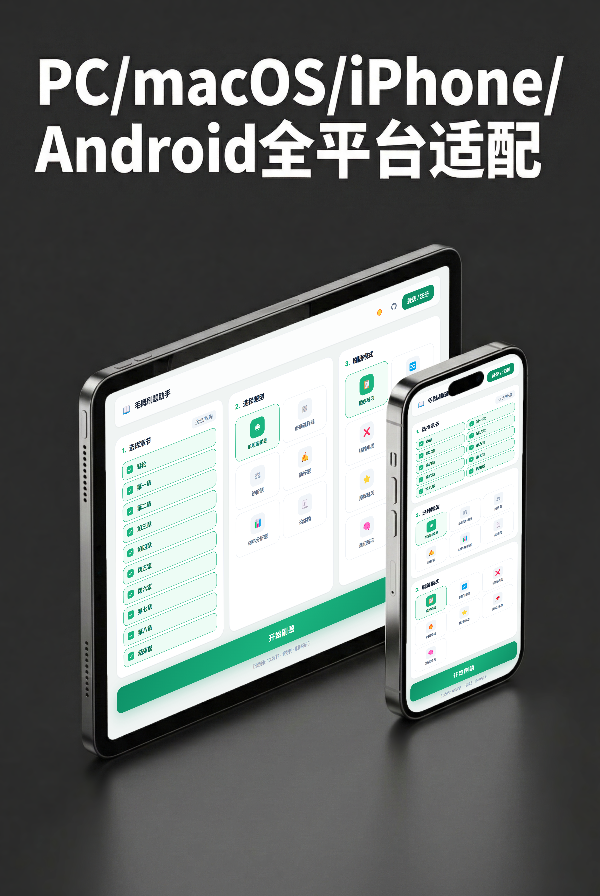
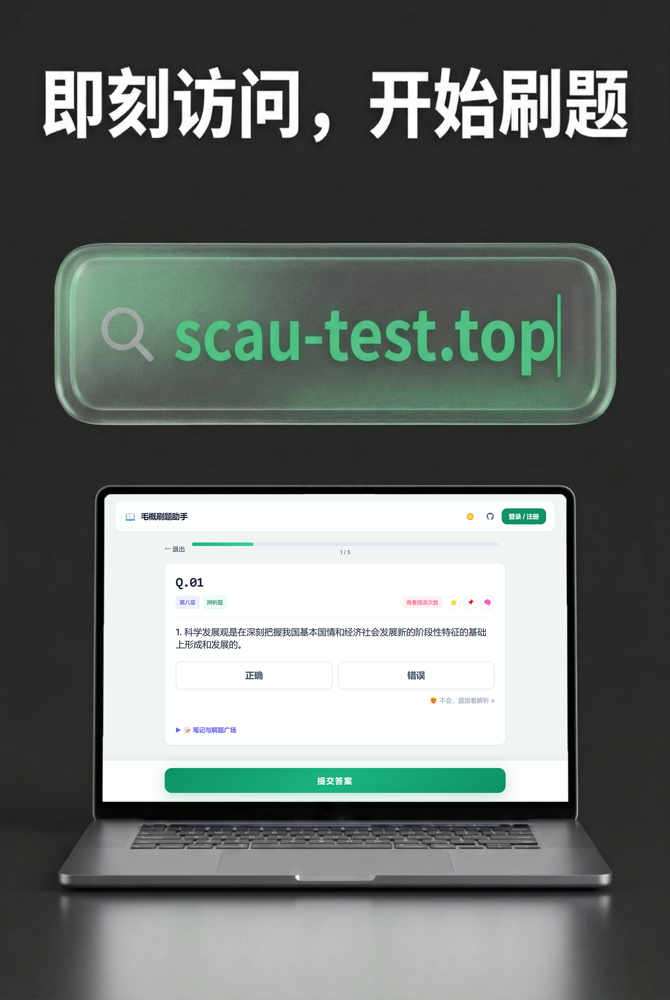

# 刷题助手 (MaoGai-Quiz-Tool)

这是一个基于 **Vue 3 + Tailwind CSS + Supabase** 的轻量级、跨平台纯前端刷题工具。整个应用作为一个静态页面运行，通过 Supabase 提供后端云服务（BaaS），实现用户认证、数据同步和社区互动。

👉 **[点击这里在线体验网站：scau-test.top](https://scau-test.top)**


## 📸 界面预览

<p align="center">
  
  
  
</p>

## 🌟 核心特性

- **纯静态零成本部署**：无构建步骤，代码修改后刷新即生效。可免费托管于 Github Pages / Cloudflare Pages / Vercel 等平台。
- **多科目支持 (新增)**：
  - 现已支持《毛泽东思想和中国特色社会主义理论体系概论》(毛概) 与《马克思主义基本原理》(马原) 双科目。
  - 科目间数据隔离，支持无缝热切换。
- **智能化刷题模式**：
  - 按章节、题型精准筛选组件
  - 顺序练习与真随机洗牌
  - 重点/难记/星标专项复习
  - **全网易错模式 (新增)**：支持自定义错误率阈值，拉取真实全网作答统计，避开陷阱题。
- **题目智能评判**：
  - 客观题自动判别，主观题需自评。
- **云端同步与安全隔离**：
  - 完整的邮箱与密码登录闭环。
  - 防丢双保险：本地秒级缓存 + 基于时间戳的比对合并，页面卸载前自动抢救未同步进度。
  - 基于 Supabase RLS (Row Level Security) 策略确保私有进度绝对安全。
- **双重防刷机制 (新增)**：
  - 前端 `reported_questions` 本地缓存防抖。
  - 后端基于 `user_id` 与 `question_id` 联合主键的物理拦截，杜绝易错榜刷榜行为。
- **解题广场互动**：
  - 用户可以将个人优质笔记分享至公共“解题广场”。
  - 广场按赞数热度降序排列。

## 📁 项目结构

```text
.
├── index.html        # 项目主入口：包含所的 UI 视图、Vue 3 业务逻辑、以及 Supabase 云端对接
├── config.js         # 全局配置：存储 Supabase 连接信息 (URL & KEY)
├── questions.js      # 封装好的题库数据，作为全局变量挂载（规避跨域限制）
├── questions.json    # 原始的题库 JSON 格式数据骨架，本项目暂不需要，可供未来参考
├── icon.png          # 网站 Favicon 图标
└── README.md         # 项目详细说明文档与部署指南
      
```

## 🚀 部署与运行指南

### 1. 本地免环境体验

确保 `config.js` 中的密钥正确，不需要装 Node.js 或启动服务，直接在浏览器中双击打开 `index.html` 即可体验完整的跨设备刷题与云端功能。

### 2. 配置专属的云端数据库 (Supabase)

即使是静态部署，也需云端数据库来支撑核心功能：
1. 注册并在 [Supabase](https://supabase.com/) 创建新项目。
2. 按照表结构（`user_progress`, `public_notes`, `note_likes`, `global_question_stats`, `user_question_reports`）建表。
3. 配置好 **RLS 策略** 和以下 **RPC 函数**，供纯前端直接调用（SECURITY DEFINER 提权运行）：
   - `report_question_attempt` (上报答题防刷校验)
   - `get_high_error_questions` (查询全网易错题排行榜)
   - `toggle_note_like` (解题广场笔记点赞)
   - `delete_user` (安全注销账号)
4. 修改代码根目录下的 `config.js` 文件：
   ```javascript
   window.APP_CONFIG = {
     SUPABASE_URL: "https://<你的_PROJECT_ID>.supabase.co",
     SUPABASE_KEY: "<你的_anon_public_key>",
   };
   ```

### 3. 公网部署

1. **提交代码至 GitHub**
2. **连接托管平台** (如 Vercel, Cloudflare, GitHub Pages)
3. **完成配置闭环**
   - 获取公网域名后，返回 **Supabase 控制台** -> `Authentication` -> `URL Configuration`。把这个公网域名填写到 **Site URL** 和 **Redirect URLs** 中（保证用户认证回调正常）。

